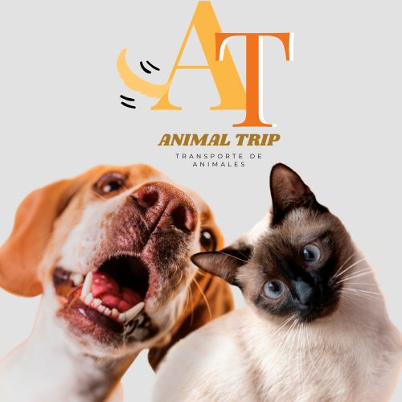
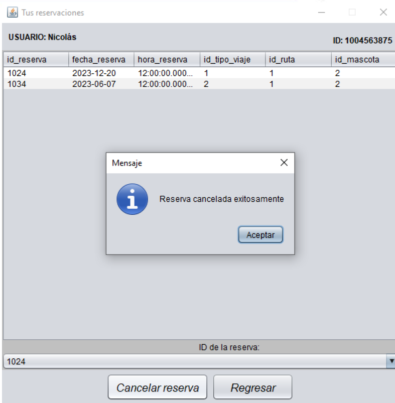
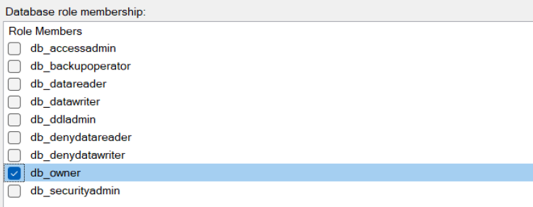

# Sistema de Transporte para Mascotas "Animal Trip"

<p align="center">
  
</p>

## Descripción del Proyecto

El proyecto consiste en el desarrollo de una aplicación de escritorio para facilitar el transporte seguro y cómodo de mascotas en trayectos largos. La aplicación permitirá a los usuarios reservar y planificar viajes para sus mascotas, asegurando estándares de confort y seguridad.

## Características Principales

- **Interfaz de Usuario Intuitiva**: Aplicación de escritorio con una interfaz gráfica fácil de usar para reservar y gestionar viajes de mascotas.
<p align="center">
  
</p>

- **Base de Datos Segura**: Utilización de Microsoft SQL Server para almacenar y administrar datos de clientes, reservas, rutas, etc., asegurando la integridad y disponibilidad de la información.

- **Desarrollo en Java**: Implementación del sistema utilizando Java, con el entorno de desarrollo NetBeans 8.2.

- **Patrón de Arquitectura MVC**: La aplicación sigue el patrón Modelo-Vista-Controlador (MVC), separando la lógica de negocio (Modelo), la presentación (Vista) y la interacción del usuario (Controlador) para mejorar la estructura y mantenibilidad del código.
- **Usuarios y Logins**: La aplicación implementa los roles de usuario, es decir que la configuracion permite que exista un Administrador, un Cliente y un Empleado.
<p align="center">
  
</p>

## Componentes del Sistema

1. **Interfaz de Usuario**: Aplicación de escritorio desarrollada en Java con NetBeans, ofreciendo una experiencia amigable para los usuarios.
   
2. **Base de Datos**: Utilización de Microsoft SQL Server como sistema de gestión de bases de datos relacional para almacenar de manera segura y eficiente la información crítica del sistema.

3. **Stored Procedures y Triggers**: Se han implementado Stored Procedures y Triggers en la base de datos para automatizar procesos y mantener la consistencia de los datos. Estas características mejoran el rendimiento y la confiabilidad del sistema, estas no fueron incluidas pero si se desea crear alguno de estos procedimientos se puede hacer.

## Instalación y Uso

Para utilizar la aplicación, se requiere tener instalado Java y Microsoft SQL Server. A continuación, los pasos para configurar y ejecutar el sistema:

1. Clonar este repositorio.
```
git clone https://github.com/Sanchez042004/animal-trip
```
3. Importar el proyecto en NetBeans.
4. Se recomienda leer la documentación y el funcionamiento para poder modificar los archivos necesarios.
5. Ejecutar la aplicación desde NetBeans.

## Autor

Andrés Sánchez - [https://github.com/Sanchez042004](https://github.com/Sanchez042004).

## Licencia

Este proyecto está licenciado bajo la Licencia MIT. Consulta el archivo [LICENSE](LICENSE) para más detalles.
